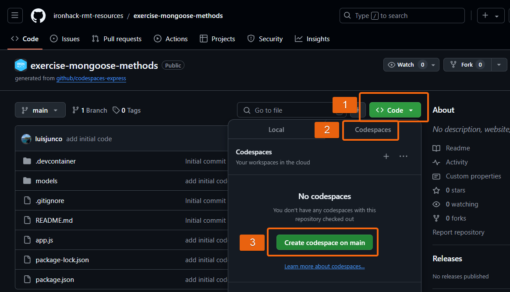
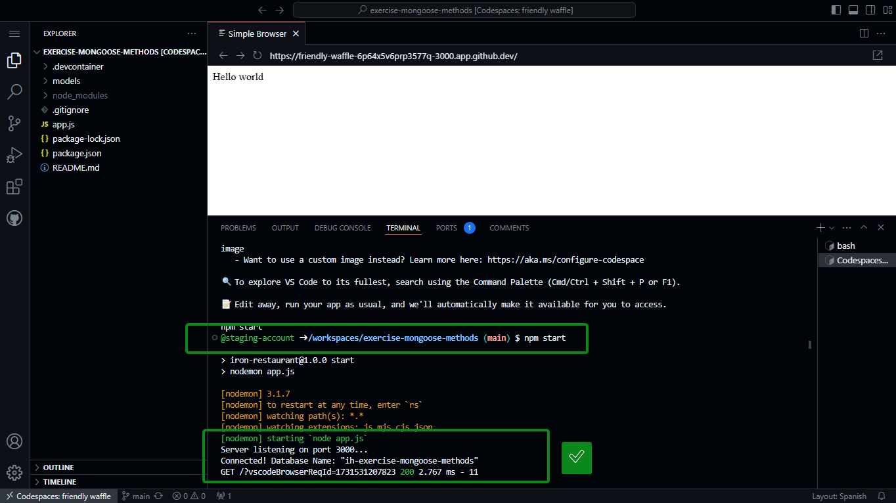
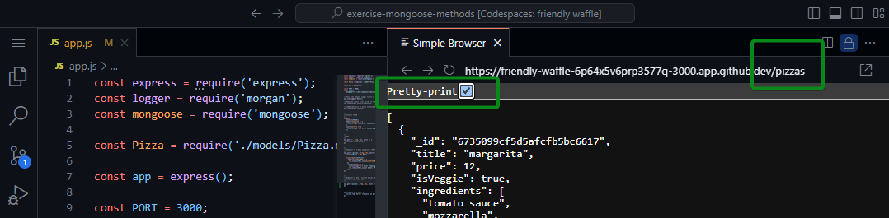
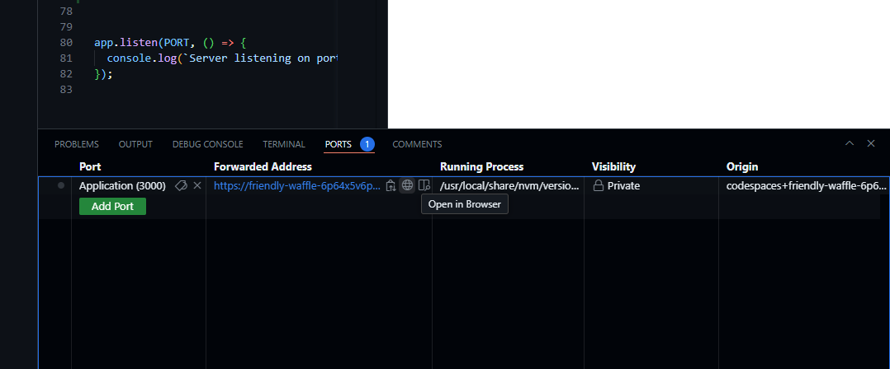

# Practice: Mongoose Methods


## Iteration 0: Initial Setup

Run this repo as a Github Codespace:




Github will open a codespace for you and it will automatically run the app with `npm start`.

If all goes well, in the terminal you should see this message:

> Connected! Database Name: "ih-exercise-mongoose-methods""





## Iteration 1: Implement an endpoint to get a list of pizzas from the DB

- In app.js, create a new route `GET /pizzas`

- Inside this route, you can use the mongoose method "find()". Example:

  ```js
  Pizza.find()
    .then()
    .catch()
  ```

## Iteration 2: test your route ;) 

To test your route:
- Go to the browser preview
- Add "/pizzas" at the end of the URL
- Hit "enter"




In case you have closed the browser preview, you can do the following:
- Open the terminal and kill the process with Ctrl + C
- Run the app again with "npm start"
- Github will then open the browser preview

... if that doesn't work, you can also open the "Ports" tab and click on the icon "Open in Browser"

